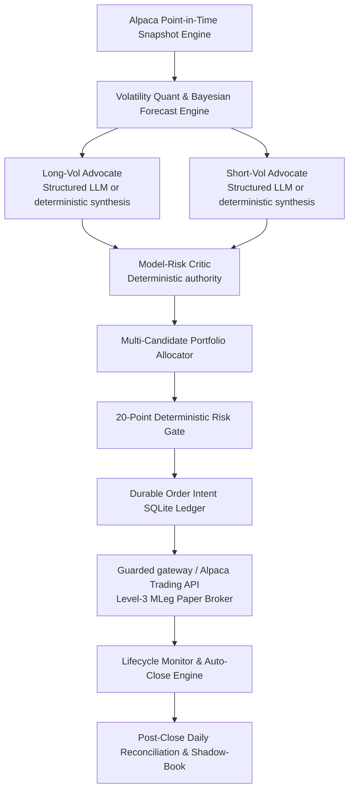

# CaiSheng — Autonomous Options Alpha Desk (Judge Summary Package)

## 1. Product Statement & Core Claim

> **CaiSheng is an autonomous, non-directional options-volatility capital allocator.**
>
> Operating on a **$100,000 competition portfolio mandate** via Alpaca Paper Trading, CaiSheng scans confirmed AMC earnings plus daily `SPY/QQQ/IWM` volatility opportunities, anchors its forecast to executable option-implied movement, and deterministically allocates `LONG_STRADDLE`, `SHORT_IRON_BUTTERFLY`, or `NO_TRADE`. Every autonomous entry requires a time-limited, account/config-bound paper authorization receipt in addition to intent persistence, SHA-256 validation, risk gates, and reconciliation.

---

## 2. Quantitative & Neuro-Symbolic Decision Architecture

### Strategy Family & Payoff Equations
1. **Long Volatility (`LONG_STRADDLE`):**
   - Condition: Forecast move > Implied move (executable edge > 0 after bid/ask spread and commissions).
   - Structure: Buy 1 ATM Call + Buy 1 ATM Put.
   - Max Loss: Net debit paid $\\le 0.5\%$ of Portfolio NAV ($\\$500 hard cap; $\\$250 target).
2. **Short Volatility (`SHORT_IRON_BUTTERFLY`):**
   - Condition: Implied move > Forecast move (executable edge > 0 after post-event IV crush haircut).
   - Structure: Sell ATM Straddle + Buy OTM Wings ($K \\pm w$).
   - Max Loss: Wing width minus net credit received $\\le 0.5\%$ of Portfolio NAV ($\\$500 hard cap; $\\$250 target).
3. **Abstention (`NO_TRADE`):**
   - Condition: Inconclusive edge, out-of-distribution IV regime, wide spreads (>25%), or active risk limit.

---

## 3. Mandatory Governance & 20-Point Risk Governor

| Risk Control Dimension | Mandate Rule & Hard Boundary | Deterministic Enforcement |
|---|---|---|
| **Competition Starting NAV** | Exactly **$100,000.00** | Initialized once in SQLite `competition_metadata` |
| **Max Concurrent Strategies** | $\\le 2$ active positions | Rejected at `PortfolioGate` |
| **Daily Entry Throttle** | $\\le 1$ new entry per trading day | Rejected at `PortfolioGate` |
| **Single Trade Risk Cap** | $\\le 0.5\%$ Portfolio NAV ($\\$500; $\\$250 target) | Checked against exact wing width / debit |
| **Portfolio Reserved Risk** | $\\le 0.5\%$ Portfolio NAV ($\\$500 at start) | Aggregated across open + pending exposures |
| **Daily Loss Kill-Switch** | $\\le -\\$500$ daily realized + unrealized | Trips persistent SQLite `runtime_halt_state` |
| **Drawdown Circuit Breaker** | $> 1.0\%$ drawdown from High-Water Mark | Trips persistent SQLite `runtime_halt_state` |
| **Autonomy Lease** | Account/config bound; maximum 8 hours; paper only | Invalid or expired receipt blocks new entries |
| **Pre-Dispatch Idempotency** | Canonical SHA-256 economic fingerprint | Prevents double-execution or parameter drift |
| **Process Exclusivity** | OS-level `fcntl.flock` kernel mutex | Eliminates concurrent scheduler races |

---

## 4. Alpaca Integration Stack: API, FastMCP, and CLI Proofs

- **Alpaca Trading API (Level 3 Multi-Leg):** Submits atomic `mleg` limit orders with verified `open`/`close` position intents.
- **Alpaca FastMCP Server (`src/volagent/data/alpaca_mcp.py`):** Exposes typed read tools (`alpaca_get_account`, `alpaca_get_positions`, `alpaca_get_orders`, `alpaca_get_market_clock`) and write gates with recursive credential redaction (`[REDACTED]`) and audit persistence (`mcp_audit_events`).
- **Headless Operations CLI (`cli.py`):**
  - `python cli.py --preflight`: Verifies paper endpoint, account snapshot, $100k starting NAV, and zero halts, outputting `data/evaluation/preflight_receipt.json`.
  - `python cli.py --reconcile`: Performs two-way broker/ledger reconciliation, outputting `data/evaluation/reconciliation_receipt.json`.
  - `python cli.py --competition-arm`: Issues the short-lived paper authorization without placing an order.
  - `python cli.py --competition-status`: Verifies receipt integrity, account/config binding, expiry, and limits.

---

## 5. Judge Cockpit UI: 1-Minute Order Auditability

The Streamlit Capital Command Cockpit (`app.py`) provides:
1. **Hero Metric Ribbon:** Real-time $100k initial NAV, live equity/P&L, reserved risk ($500 portfolio cap), and circuit breaker.
2. **Competition Control Strip:** `ARMED/DISARMED`, paper-only status, expiry, $250/$500 trade risk, one-entry/day throttle, two-position cap, and `SPY/QQQ/IWM` scan policy.
3. **Decision Timeline:** Chronological feed of immutable `caisheng.decision.v1` records with SHA-256 hashes and structured proposal logs.
4. **Closed-Trade Accounting Journal:** Entry/exit order tracking, fill prices, costs, holding duration, and return on risk.
5. **Direct Operations Proofs:** One-click CLI, reconciliation, MCP, and audit verification.

---

## 6. Honest Limitations & Integrity Declaration

- **Paper Execution Environment:** Operates exclusively on Alpaca Paper Trading (`https://paper-api.alpaca.markets`). No live-money orders are ever placed.
- **Realistic Execution Friction:** Model accounts for wide options spreads (slippage penalty) and per-contract exchange fees.
- **No Alpha Overclaim:** Implied move is the anchor. A residual correction may override it only when walk-forward evidence supports that correction; otherwise CaiSheng defers or returns `NO_TRADE`.
- **Current Competition Result:** Zero broker-confirmed closed trades and $0 realized P&L at the time of this write-up. Replay P&L is functional evidence only.
